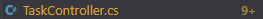

# OLA 3

1. CRUD controller, model and data can all be found in /RestAPI/ folder

2. Unit tests are found in /RestAPI.Tests/UnitTest.cs. The code coverage can be found in the Reflection.pdf and in /RestAPI.Tests/coverage-report/index.html file

3. These test can be found in /RestAPI.Tests/ValidationTests.cs

4. I could not figure out how to get FxCop to generate a report but i did use it to help find issues in my controller (can read more in reflection): 

7. Since I am working alone I couldn’t do the peer code review but I tried my best to review the code myself.

8. Found in Reflection.pdf

9. Found in Reflection.pdf
